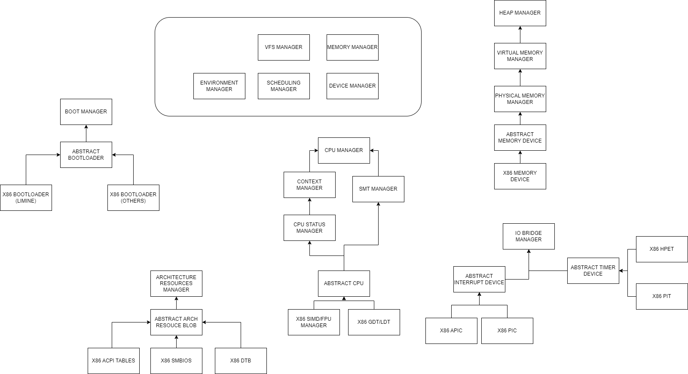
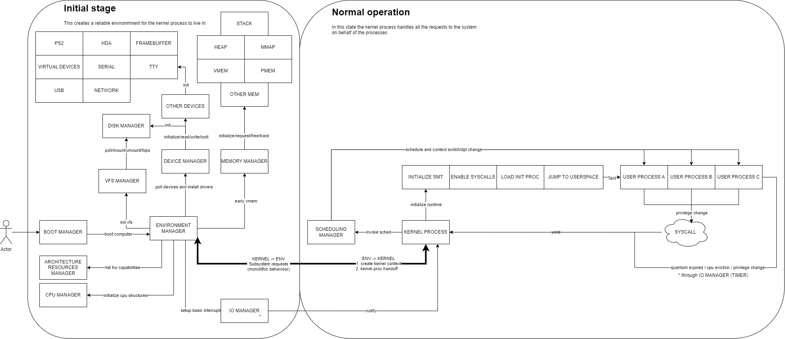

# This is the high level architecture of the project.

As you can see the hardware devices we are abstracting are the following (for x86 reference):

- CPU
- Memory
- Interrupt controller
- Timer
- Disk
- Other devices (keyboard, mouse, serial, network, etc)

Other than that we will handle three more concepts as hardware:

- The bootloader
- The firmware tables
- Virtual devices (FIFOs, TTYs, etc)

Libraries and apps/utils are not reflected in this diagram as they should be placed inside each module.

## Master modules

The most important modules in the project are the following:

- Environment manager
- Memory manager
- Device manager
- Scheduling manager
- VFS manager

## Device modules

The device modules are the following:

- Boot manager
- CPU manager
- Architecture resources manager (firmware tables)
- IO bridge manager (Interrupts, Timer, etc)
- Memory manager (not present per se in the diagram) (heap, virtual mem, phys mem, etc)

## Flow diagram

The flow diagram is the following:

First of all our bootloader should place us in the following state:

- The CPU is in 64-bit mode
- Virtual memory is enabled
- Physical memory is identity mapped
- All interrupts are disabled
- The stack is set up

Finally at handoff the environment manager elf is loaded and execution starts at the `_start` function. It performs the following steps in order:

0. Makes sure we can debug the kernel
1. Initializes early cpu state (fpu, simd, etc)
2. Initializes the memory manager
3. Sets up virtual memory
4. Initializes the heap
5. Sets up the GDT
6. Sets up the interrupts
7. Initializes the PIT and HPET timers
8. Prepares the cpus for smt if needed
9. Reads the acpi tables
10. Initialices the device manager
11. Initialices the vfs manager
12. Initializes the scheduler

After this, handoff to the real kernel elf is performed.

## Module list and maintainers

The list of modules and maintainers is the following:

- Boot manager: @TODO
- CPU manager: @TODO
- Architecture resources manager: @TODO
- IO bridge manager: @TODO
- Memory manager: @TODO
- Environment manager: @TODO
- Device manager: @TODO
- Scheduling manager: @TODO
- VFS manager: @TODO

## Driver list and maintainers

The list of drivers and maintainers is the following:

- Keyboard: @TODO
- Mouse: @TODO
- Serial: @TODO
- Network: @TODO
- Disk: @TODO
- Other devices: @TODO

## Library/app list and maintainers

The list of libraries and maintainers is the following:

- Panic: @TODO
- Linked list: @TODO
- Buddy allocator: @TODO
- ELF loader: @TODO
- Bitfield allocator: @TODO
- Hash table: @TODO
- String operations: @TODO
- Math operations: @TODO
- Concurrency primitives: @TODO

## Misc maintainers

The list of misc maintainers is the following:

- Documentation portal: @TODO
- CI/CD: @TODO
- Website: @TODO
- Community manager: @TODO
- Security manager: @TODO
- Performance manager: @TODO
- Testing manager: @TODO
- Legal manager: @TODO